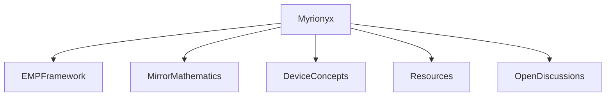

# 👋 Welcome to Myrionyx

**Building open ideas at the intersection of biology, biophysics, mathematics, and biomedical innovation.**

---

## About

Myrionyx is an independent open research initiative focused on developing interdisciplinary theoretical frameworks and conceptual biomedical technologies.

Our mission is to encourage collaboration across scientific disciplines by exploring open questions, mathematical models, and innovative ideas inspired by biological systems.

This initiative values curiosity, transparency, constructive criticism, and open scientific discussion.

---

## Current Projects

🔬 **EMP Framework**

Developing the theoretical foundations of Endogenous Mirroring Phenomena (EMP).

📐 **Mirror Mathematics**

Building a mathematical language for describing biological mirroring and complex biological states.

🧩 **Device Concepts**

Exploring conceptual biomedical technologies and future diagnostic systems inspired by the EMP framework.

---

## Research Areas

* Biophysics
* Mathematical Biology
* Systems Biology
* Biomedical Engineering
* Biological Information
* Computational Thinking
* Open Science

---

## Our Philosophy

We believe scientific progress begins with questions.

Not every idea becomes a theory.

Not every theory becomes a technology.

But every meaningful discovery starts with curiosity.

---

## Get Involved

Researchers, engineers, mathematicians, students, clinicians, and innovators from all backgrounds are welcome to contribute.

Ways to participate include:

* Discussing open scientific questions
* Suggesting mathematical formulations
* Proposing conceptual device designs
* Improving documentation
* Sharing constructive feedback

---

## Current Status

🟢 Early-stage conceptual research.

This initiative is focused on building theoretical foundations and encouraging interdisciplinary collaboration.

---

## Founder

**Mahdieh Emadi**

Independent Researcher

Founder of Myrionyx

---

> *Exploring today's questions to inspire tomorrow's discoveries.*
>
> ## Ecosystem


## Publications

The scientific publications supporting this initiative are available in the **publications** directory.

```
Myrionyx
└── publications
```
